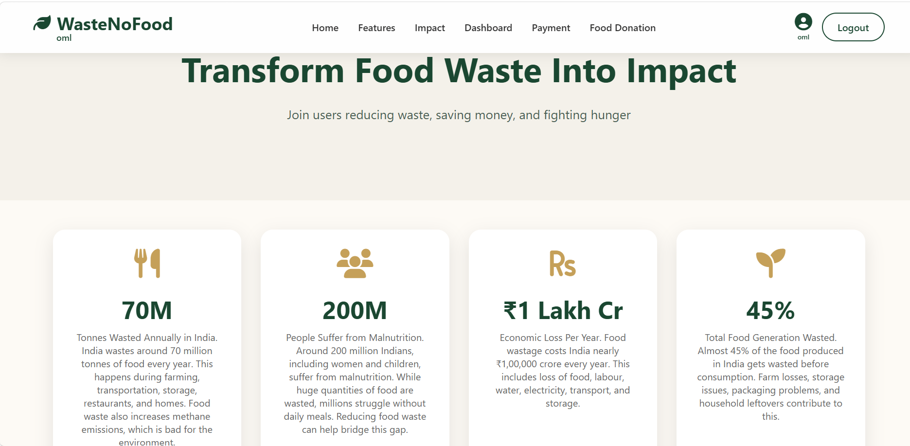
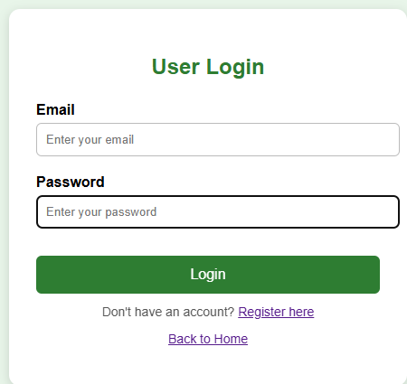
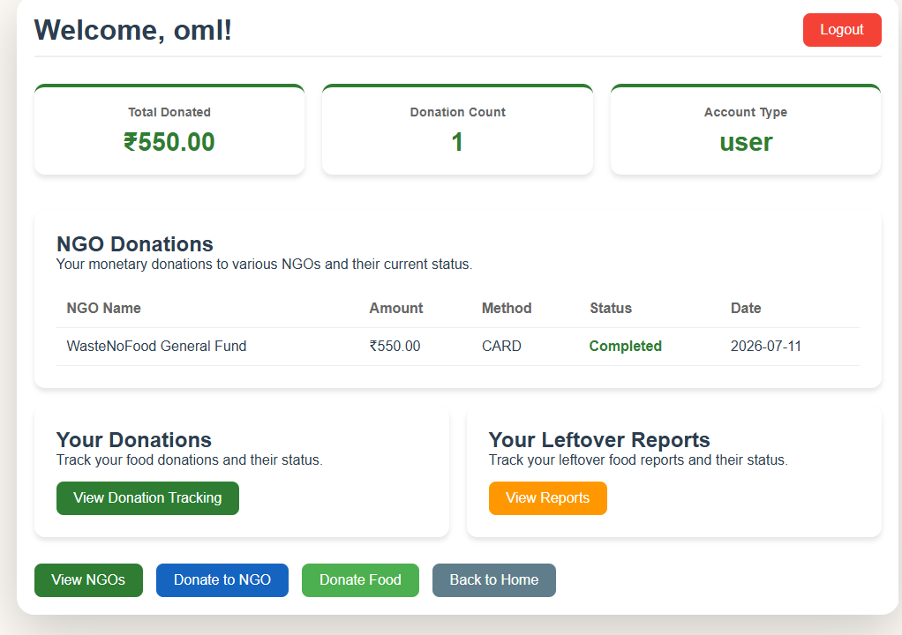
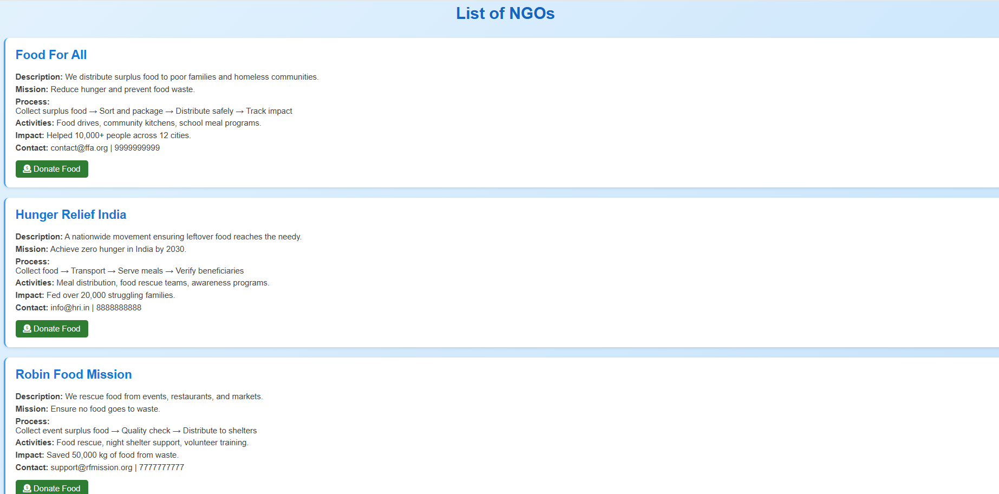
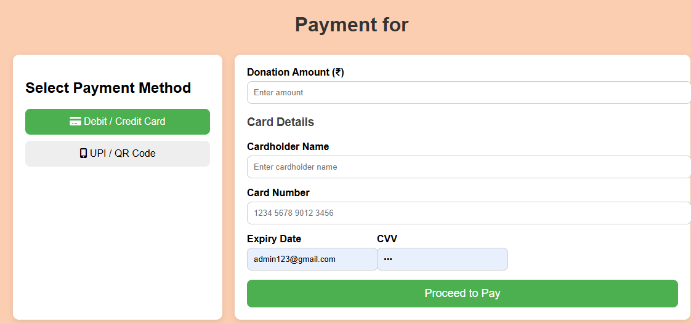
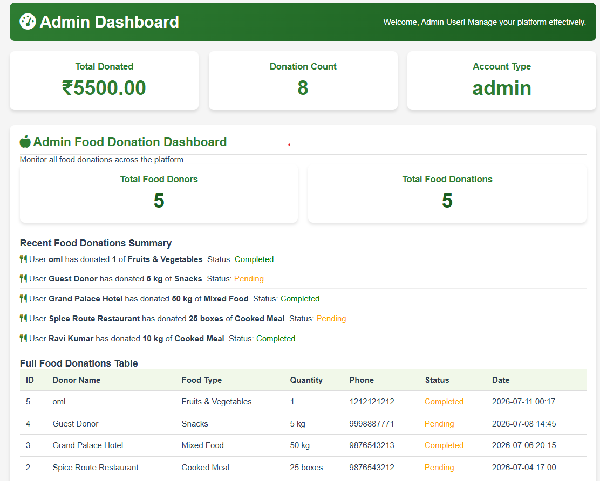

# 🍽️ Food Waste Management System

A Full Stack Web Application developed using **Python Flask, MySQL, HTML, CSS and JavaScript** that helps reduce food waste by connecting food donors with NGOs.

---


## 🌐 Deployment

🚀 **Experience the application live here:**

👉 [Food Waste Management System](https://foodwastemanagement-tbcu.onrender.com/)

The project is deployed successfully on **Render** and demonstrates a complete full-stack workflow including frontend, backend, database integration, and user management.

## 🚀 Features

✅ User Registration & Login

✅ NGO Registration & Login

✅ Admin Dashboard

✅ Food Donation Management

✅ Monetary Donation System

✅ Donation Tracking

✅ Leftover Food Reporting

✅ Proof of Delivery

✅ NGO Verification

✅ Secure Authentication

---

## 🛠 Tech Stack

### Frontend
- HTML5
- CSS3
- JavaScript

### Backend
- Python
- Flask

### Database
- MySQL (XAMPP)

### Tools
- Git
- GitHub
- VS Code
- XAMPP

---

# 📷 Screenshots

## Home Page



---

## User Login



---

## Dashboard



---

## NGO Dashboard



---

## Payment Page



---

## Admin Dashboard



---

# ⚙ Installation

Clone the repository

```bash
git clone https://github.com/ommahavarkar-2006/FoodWasteManagement.git
```

Go to project

```bash
cd FoodWasteManagement
```

Install packages

```bash
pip install -r requirements.txt
```

Import

```
database.sql
```

into

```
phpMyAdmin
```

Run

```bash
python app.py
```

Open

```
http://127.0.0.1:5000
```

---

# 📂 Project Structure

```
FoodWasteManagement
│
├── static
├── templates
├── screenshots
├── app.py
├── database.sql
├── requirements.txt
└── README.md
```

---

# 👨‍💻 Developed By

**Om Mahavarkar**

B.Sc IT Student

Full Stack Developer

GitHub

https://github.com/ommahavarkar-2006

---

# ⭐ Support

If you like this project,

⭐ Give this repository a Star.
